# 2048 Game on Kubernetes with KIND

<br>


[](https://www.gnu.org/software/bash/) 
[](https://www.docker.com/) 
[](https://kind.sigs.k8s.io/) 
[](https://kubernetes.io/) 
[](https://nginx.org/) 
[](https://www.python.org/) 
[](https://opensource.org/licenses/MIT)


Forked from the classic 2048 web game, this project runs the game on a local Kubernetes cluster using KIND (Kubernetes in Docker).  
It demonstrates containerization, Kubernetes orchestration, Helm deployments, and automation scripts for easy setup and cleanup in a development environment.


## Contents

- [Project Purpose](#project-purpose)
- [Prerequisites](#prerequisites)
- [Step-by-Step Deployment](#step-by-step-deployment)
  - [Step 1: Clone the repository](#step-1-clone-the-repository)
  - [Step 2: Create a KIND Cluster](#step-2-create-a-kind-cluster)
  - [Step 3: Build Docker Image and Load into KIND Cluster](#step-3-build-docker-image-and-load-into-kind-cluster)
  - [Step 4: Deploy NGINX Ingress Controller](#step-4-deploy-nginx-ingress-controller)
  - [Step 5: Add Local Host Entry](#step-5-add-local-host-entry)
  - [Step 6: Deploy the 2048 Application and Access It](#step-6-deploy-the-2048-application-and-access-it)
- [Deploy with Helm (Optional) ](#deploy-with-helm-optional)
- [Deploy with Scripts for Automation (Optional) ](#deploy-with-scripts-for-automation-optional)
- [Cleanup & Removing Resources](#cleanup--removing-resources)
  - [Uninstall with Scripts](#uninstall-with-scripts)
- [Troubleshooting](#troubleshooting)
- [Project Structure](#2048-on-kind-project-structure)
- [System Architecture Overview](#system-architecture-overview)
- [End-to-End Request Lifecycle](#end-to-end-request-lifecycle-in-kubernetes)
- [Project Highlights & Architecture Insights](#project-highlights--architecture-insights)
- [License ](#license)


## Project Purpose

The goal of this project is to **containerize and deploy the classic 2048 web game** on a local Kubernetes cluster using **KIND (Kubernetes IN Docker)**.  

This project demonstrates how to:

- Run the classic 2048 web game by **building our own Docker image** from the forked repository [gabrielecirulli/2048](https://github.com/gabrielecirulli/2048) and **writing our own Dockerfile**.
- Deploy it with **Kubernetes manifests** or **Helm**.
- Deploy and remove it easily with **automation scripts** — **Bash** (`install.sh`, `uninstall.sh`) and **Python** (`install.py`, `uninstall.py`).
- Expose the application via **Ingress** for browser access.
- Run a **local Kubernetes cluster** easily using KIND.

By the end, you will be able to open your browser at `http://2048.local` and play the game directly from your local Kubernetes environment.

---

## Prerequisites

Before starting, make sure you have **administrator/root privileges** on your operating system, as some commands (like Docker setup or KIND node creation) may require elevated permissions.

You will also need the following tools installed:


| Tool | Minimum Version | Purpose |
|------|----------------|---------|
| [Docker](https://www.docker.com/products/docker-desktop) | 20.10+ | To run KIND nodes and build Docker images. |
| [KIND](https://kind.sigs.k8s.io/) | 0.30.0 | To create a local Kubernetes cluster. |
| [kubectl](https://kubernetes.io/docs/tasks/tools/) | 1.34.1 | Kubernetes CLI to interact with the cluster. |
| [Helm](https://helm.sh/) | 3.19.0 | To deploy the 2048 game via Helm chart. (Optional) |
| [Python 3](https://www.python.org/downloads/) | 3.8+ | Required to run the install/uninstall automation scripts. (Optional) |
| [Git](https://git-scm.com/) | 2.51.1 | To clone this repository. |
| Web Browser | - | To access the game at `http://2048.local`. |


<br>

**Notes:**
- **Installation instructions for all the tools listed above can be found via the provided links. Please refer to the official documentation for detailed setup steps.**

- Docker Desktop 4.47+ is recommended to avoid security issues.
- Helm is used to deploy and manage the 2048 game easily by packaging all Kubernetes manifests into a single chart.

<br>

> 💡 **Platform-specific installation:**  
> - **macOS:** Use [Homebrew](https://brew.sh/) to install the tools.  
> - **Linux:** Use your distribution's package manager (e.g., `apt` for Ubuntu/Debian, `dnf` for Fedora, `yum` for CentOS).  
> - **Windows:** Use [Chocolatey](https://chocolatey.org/) to install the tools.

---

## Step-by-Step Deployment

### Step 1: Clone the repository

```bash
git clone https://github.com/kadirariklar/game-2048-for-k8s.git
cd game-2048-for-k8s
```


### Step 2: Create a KIND Cluster

> **Note:** For the Ingress controller we will set up later, the `extraPortMappings` parameter needs to be added for the worker node in the `kind-config.yaml` to expose the service externally without using `kubectl port-forward` or NodePort.
 

The cluster has been created with **one master and one worker node**.  
If a different cluster configuration is desired, the `kind-config.yaml` can be edited accordingly.


```bash
kind create cluster --config kind-config.yaml
```

Verify the nodes:

Check that all nodes are ready:

```bash
kubectl get nodes
```

You should see output similar to:

```
NAME                           STATUS   ROLES           AGE   VERSION
cluster-local-control-plane    Ready    control-plane   1m    v1.34.0
cluster-local-worker           Ready    <none>          1m    v1.34.0

# Make sure all nodes have "STATUS: Ready" before proceeding.

```

### Step 3: Build Docker Image and Load into KIND Cluster

Build the Docker image using the provided Dockerfile and make it available to the KIND cluster:

```bash
docker build -t game-2048-image .
```

Load the image into the KIND cluster so it can be used by the deployments.

```bash
kind load docker-image game-2048-image --name cluster-local
```


> **Note:** The --name parameter must match the name of your KIND cluster (cluster-local in this setup), otherwise the cluster will not see the image and your pods may fail with ImagePullBackOff.

### Step 4: Deploy NGINX Ingress Controller

To make your 2048 web app accessible via a hostname (e.g., `2048.local`), this project uses an **Ingress controller (NGINX)** to expose the Service outside the cluster.
 
We will deploy the **NGINX Ingress Controller** to handle incoming HTTP requests and route them to the application service.

> **Note:** The NGINX Ingress Controller pods can take some time to become fully ready (usually around 2 minutes). Please be patient while they start. This applies to both the bash and Python deployment scripts later in this project.


Deploy the controller using the following command:

```bash
kubectl apply -f https://kind.sigs.k8s.io/examples/ingress/deploy-ingress-nginx.yaml
```

Check that the Ingress pods are running:

```bash
kubectl get pods -n ingress-nginx
```

```
# You should see output similar to:

NAME                                        READY   STATUS      RESTARTS   AGE
ingress-nginx-controller-xxxxxxxxxx-xxxxx   1/1     Running     0          1m
ingress-nginx-admission-create-xxxxx        0/1     Completed   0          1m
ingress-nginx-admission-patch-xxxxx         0/1     Completed   0          1m
```

Check that the Ingress class exists:

```bash
kubectl get ingressclass
```

```bash
# Expected output:

NAME    CONTROLLER
nginx   k8s.io/ingress-nginx

# Make sure the controller pod is Running and the Ingress class (nginx) exists before proceeding.
```

### Step 5: Add Local Host Entry

To access your 2048 web app via the hostname `2048.local` in your browser, you need to map this hostname to `127.0.0.1` in your system's hosts file. This ensures that requests to `2048.local` are routed to your local KIND cluster.

**On macOS and Linux:**

```bash
sudo sh -c 'echo "127.0.0.1 2048.local" >> /etc/hosts'
```

**On Windows OS:**

Open the hosts file as Administrator located at:

```bash
C:\Windows\System32\drivers\etc\hosts
```

Add the following line at the end of the file:

```bash
127.0.0.1 2048.local
```

Save the file.

Also PowerShell command can be used:

```powershell
Add-Content -Path C:\Windows\System32\drivers\etc\hosts -Value "127.0.0.1 2048.local"
```

### Step 6: Deploy the 2048 Application and Access It

Navigate to the `manifests` folder where your Kubernetes manifests are located:

```bash
cd k8s/manifests 
```

Deploy the application, service, and ingress:

```bash
kubectl apply -f .
```

Verify that the pods are running:

```bash
kubectl get pods,svc,ingress
```

```bash
# Expected output:

NAME                                READY   STATUS    RESTARTS   AGE
pod/game-2048-xxxxxxxxxx-xxxxx      1/1     Running   0          1m

NAME                 TYPE        CLUSTER-IP     EXTERNAL-IP   PORT(S)   AGE
svc/game-2048        ClusterIP   10.96.x.x      <none>        80/TCP    1m
svc/kubernetes       ClusterIP   10.96.x.x      <none>        443/TCP   10m

NAME                                          CLASS   HOSTS        ADDRESS   PORTS   AGE
ingress.networking.k8s.io/game-2048-ingress   nginx   2048.local   localhost 80      1m

```

Once all pods are Running and services/ingress are active, open your browser and navigate to:

<a>http://2048.local</a>


**You should see the classic 2048 game running.**

**Game Controls & Objective:**
- **Arrow Keys (↑ ↓ ← →):** Use the arrow keys to slide all the numbered tiles in the chosen direction across the grid.
- **Merging Tiles:** When two tiles of the same number collide, they combine into a single tile with a value equal to their sum.
- **2048 Tile:** Your main goal is to create a tile with the number **2048**, which represents the winning condition of the classic game.
- **Strategic Planning:** Think ahead and plan your moves carefully, because every slide affects the board layout and future merging opportunities.
- **Avoiding Gridlock:** Ensure you leave space for new tiles to appear, otherwise the game can end prematurely if the board fills up.
- **Scoring:** Each merge increases your score, rewarding careful strategy and efficient moves.

---

## Deploy with Helm (Optional)

Before Helm installation, it is recommended to run the following in the same directory (/k8s/manifests) to remove any previously applied Kubernetes manifests.

```bash
kubectl delete -f .
```

Navigate to the Helm chart directory:

```bash
cd ../helm-2048
```

Install the Helm chart:

```bash
helm install game-2048 .
```

Check the resources:

```bash
kubectl get pods,svc,ingress
```

```bash
# Expected output:

NAME                                  READY   STATUS    RESTARTS   AGE
pod/game-2048-xxxxxxxxxx-xxxxx        1/1     Running   0          1m

NAME                     TYPE        CLUSTER-IP       EXTERNAL-IP   PORT(S)   AGE
service/game-2048        ClusterIP   10.96.123.45     <none>        80/TCP    1m

NAME                             CLASS   HOSTS         ADDRESS   PORTS   AGE
ingress.networking.k8s.io/2048   nginx   2048.local    localhost 80      1m

```

You can also verify the Helm release is deployed correctly using:

```bash
helm list 
```

```bash

# Expected output:

NAME     	NAMESPACE	REVISION	UPDATED                             	STATUS  	CHART          	  APP VERSION
game-2048	default  	1       	2025-10-18 13:39:59.339314 +0300 +03	deployed	2048-helm-0.1.0	  latest

```

Once all pods are in the Running state, open your browser and visit:

👉 http://2048.local

You should see the classic 2048 game running.

To uninstall the release, use the following command:

```bash
helm uninstall game-2048
```

---

## Deploy with Scripts for Automation (Optional)

> 💡 **Why use scripts (Python & Bash)?**  
>
> - They automate the entire deployment — no manual commands needed.  
>
> - **Bash** is fast and native for Linux, while **Python** is cleaner and more portable.  
>
> - Choose whichever suits your environment best.
>
> **Note:** These scripts are primarily designed for **Linux/macOS** environments.  

After cloning the repository, navigate into the project and run one of the provided scripts with root/admin privileges.

```bash
cd game-2048-for-k8s/scripts
```

To deploy the 2048 game:

- **For Bash:**
 
  ```bash 
  sudo bash install.sh
  ```

- **For Python:**

  ```bash 
  sudo python3 install.py
  ```

---

## Cleanup & Removing Resources

After finishing your work with the 2048 game on your local Kubernetes cluster, you may want to completely clean up all related resources to free up system space and avoid conflicts in future deployments. Follow the steps below for a full cleanup:

**1. Delete the KIND Cluster:**  
This command will remove the entire local Kubernetes cluster along with all its deployed resources, including pods, services, and deployments.

```bash
kind delete cluster --name cluster-local
```

**2. Remove the Docker Image:**
If you built a local Docker image for the game, you can delete it to reclaim disk space.

```bash
docker rmi game-2048-image:latest
```

**3. Clean Up Hosts File Entry:**  
If you added an entry to your hosts file to access the game via `http://2048.local`, you should remove it to avoid conflicts. Use the appropriate method for your operating system:

- **macOS / Linux:**

  - **macOS:**
  
    ```bash
    sudo sed -i '' '/2048.local/d' /etc/hosts
    ```

  - **Linux:**
  
    ```bash
    sudo sed -i '/2048.local/d' /etc/hosts
    ```

- **Windows (PowerShell):**  
  Open PowerShell as Administrator and run the following command to remove the `2048.local` entry from your hosts file:

  ```powershell
  (Get-Content -Path "C:\Windows\System32\drivers\etc\hosts") | Where-Object { $_ -notmatch "2048.local" } | Set-Content -Path "C:\Windows\System32\drivers\etc\hosts"
  ```

## Uninstall with Scripts

Navigate to the `scripts` directory inside the project. 

- **For Bash:**
 
  ```bash 
  sudo bash uninstall.sh
  ```

- **For Python:**

  ```bash 
  sudo python3 uninstall.py
  ```

---

## Troubleshooting

- **503 Service Temporarily Unavailable (nginx)**  
  - **Cause:** Pods are not ready or Service/Ingress routing is not functioning correctly.  
  - **Check:** Verify pod status with `kubectl get pods` and routing with `kubectl describe svc/ingress`.

- **404 Not Found (nginx)**  
  - **Cause:** Ingress or path rule is incorrect, or Service cannot find target pods.  
  - **Check:** Confirm Ingress host and path rules, and Service selectors.

- **DNS_PROBE_FINISHED_NXDOMAIN / "This site can’t be reached"**  
  - **Cause:** `2048.local` is missing or mistyped in the hosts file.  
  - **Check:** Verify `/etc/hosts` (macOS/Linux) or `C:\Windows\System32\drivers\etc\hosts` (Windows).

- **ERR_CONNECTION_REFUSED / "2048.local refused to connect"**  
  - **Cause:** Ingress Controller is not running or port mapping is missing.  
  - **Check:** Inspect ingress pods with `kubectl get pods -n ingress-nginx` and service ports with `kubectl get svc -n ingress-nginx`.

---

## 2048-on-KIND Project Structure

```
game-2048-for-k8s/      
├── Dockerfile                                            Multi-layer container image definition for the 2048 game
├── README.md                                             Project documentation and setup instructions
├── app/                                                  2048 game source code
│   ├── CONTRIBUTING.md                                   Contribution guidelines
│   ├── LICENSE.txt                                       Project license information
│   ├── favicon.ico                                       Website favicon
│   ├── index.html                                        Main HTML entry point for the game
│   ├── js/                                               JavaScript game logic
├── images/                                               Project diagrams and architecture visuals
│   └── production-scenario-architecture-picture.png      Production scenario architecture diagram 
├── k8s/                                                  Kubernetes configuration
│   ├── helm-2048/                                        Helm chart
│   │   ├── Chart.yaml                                    Helm chart metadata
│   │   ├── templates/                                    Helm templates
│   │   │   ├── deployment.yaml                           Deployment manifest
│   │   │   ├── ingress.yaml                              Ingress manifest
│   │   │   └── service.yaml                              Service manifest
│   │   └── values.yaml                                   Configurable Helm values
│   └── manifests/                                        Raw Kubernetes manifests
│       ├── deployment.yaml                               Deployment specification
│       ├── ingress.yaml                                  Ingress rules
│       └── service.yaml                                  Service definition
├── kind-config.yaml                                      KIND cluster configuration (main project cluster)
└── scripts/                                              Automation scripts
    ├── install.py                                        Python install script for deployment
    ├── install.sh                                        Bash install script for deployment
    ├── resources/                                        Supporting resources for scripts
    │   └── kind-config.yaml                              KIND cluster config specifically used by scripts
    ├── uninstall.py                                      Python uninstall script to clean up deployment
    └── uninstall.sh                                      Bash uninstall script to clean up deployment


```

---

## System Architecture Overview


---

## End-to-End Request Lifecycle in Kubernetes

```mermaid
%%{init: {
  "theme": "base",
  "themeVariables": {
    "primaryColor": "#2563EB",
    "primaryTextColor": "#FFFFFF",
    "primaryBorderColor": "#1E40AF",
    "clusterBkg": "#0F172A",
    "clusterBorder": "#1E293B",
    "edgeLabelBackground": "#1E293B",
    "lineColor": "#64748B",
    "fontFamily": "Inter, sans-serif",
    "fontSize": "11px"
  }
}}%%
flowchart TD
    Browser["🌐 Browser<br/>2048.local"]:::client
    DNS["🧭 DNS Resolver"]:::infra
    Docker["🐳 Docker Engine<br/>Port 80"]:::infra
    Ingress["🚪 Ingress Controller<br/>nginx"]:::k8s
    Rule["📘 Ingress Rule<br/>2048.local"]:::k8s
    Service["⚙️ Service<br/>game-2048"]:::k8s
    Pod["📦 Pod<br/>game-2048"]:::k8s

    %% Vertical flow
    Browser -->|"1. DNS"| DNS
    DNS -->|"2. Resolve"| Docker
    Docker -->|"3. Forward"| Ingress
    Ingress -->|"4. Match"| Rule
    Rule -->|"5. Route"| Service
    Service -->|"6. Load"| Pod
    Pod -->|"7. Response"| Service
    Service --> Rule
    Rule --> Ingress
    Ingress --> Docker
    Docker -->|"8. Return"| Browser

    %% Style
    classDef client fill:#3B82F6,stroke:#1E40AF,color:#FFFFFF,rx:6,ry:6,stroke-width:1px;
    classDef infra fill:#60A5FA,stroke:#1E3A8A,color:#FFFFFF,rx:6,ry:6,stroke-width:1px;
    classDef k8s fill:#1E3A8A,stroke:#0F172A,color:#FFFFFF,rx:6,ry:6,stroke-width:1px;

```



---

## Project Highlights & Architecture Insights

## Key Advantages

- **Helm-Based Deployment** 
  - Centralizes configuration via `values.yaml`.
  - Supports easy scaling (replica counts), image updates, and probe adjustments.
  - Ensures repeatable, version-controlled deployments.
  - Simplifies testing of upgrades and rollback scenarios.

- **Lightweight and Efficient Container** 
  - `nginx:alpine` serves static content with minimal CPU and memory footprint.
  - Single-stage build copies all HTML/CSS/JS into the default Nginx web root.
  - Fast startup, simple lifecycle management, and compatibility with Kubernetes health checks.

- **Health-Driven Architecture** 
  - **Readiness Probe** ensures pods only receive traffic when fully initialized.
  - **Liveness Probe** guarantees automatic recovery if a pod becomes unresponsive.
  - Reduces downtime and improves reliability even in local clusters.

- **Resource Management & Scalability** 
  - CPU and memory **requests and limits** prevent resource contention.
  - Supports horizontal scaling (replicas) without overloading nodes.
  - Stateless design allows multiple pods to be deployed quickly for high availability testing.

- **Ingress Integration & Networking** 
  - Local domain access via `2048.local` simulates real-world routing.
  - Works seamlessly with NGINX Ingress Controller for HTTP traffic routing.

- **Developer-Friendly Setup & Cleanup via Scripts** 
  - **Bash Scripts:** `install.sh` and `uninstall.sh`  
    Automate deployment and cleanup: build Docker image, create KIND cluster, deploy manifests, and clean hosts file.
  - **Python Scripts:** `install.py` and `uninstall.py`  
    Cross-platform alternative with clearer error handling and flexibility.  
  - Scripts ensure **repeatable, fast, and clean** environment setup for local development or testing.


---

## **2048 Game Kubernetes Deployment Architecture (Real Production Scenario)**  

Below is a visual representation of how the **2048 Game** operates in a **production-level Kubernetes environment**, where user traffic flows through the **Load Balancer** and **Ingress Controller** to reach the **2048 Game Pods** running on worker nodes.  The game state and session data are handled by **Redis**, backed by **Persistent Volumes** for durability, while all components are monitored through **Prometheus/Grafana** and logs are centralized using the **ELK stack**, showcasing a scalable, observable, and production-ready Kubernetes setup.

> **Note:** This architecture is for demonstration purposes only and simulates a production-like scenario, not an actual production deployment.


## Current Limitations & Potential Improvements

- **TLS/SSL**: Currently absent. Could implement self-signed certificates for local HTTPS or use `cert-manager` for production.
- **Authentication/Authorization**: No login or access control; could integrate **OAuth2 Proxy** or similar solutions.
- **Rate Limiting & Security Headers**: Not configured. Useful for mimicking production traffic scenarios.
- **Logging & Monitoring**: Basic stdout/stderr logging only. Full observability would require ELK/EFK or Prometheus metrics.
- **Horizontal Pod Autoscaling**: Not implemented—replica scaling is manual.
- **Persistent Storage**: Stateless design; no PVs included. Could integrate PVCs if state persistence is desired.
- **Advanced Network Policies**: No Cilium/Calico policies applied; security segmentation could be added.
- **Sidecar Containers**: None currently (logging, monitoring, or proxy sidecars could enhance observability and control).


## Summary

This project demonstrates a **production-like deployment setup** for a simple static web game using:

- **KIND** for local Kubernetes cluster orchestration.
- **Helm** for templated and repeatable deployments.
- **Nginx** serving static content efficiently.
- **Liveness and readiness probes** for pod health management.
- **Resource limits** to control CPU and memory usage.
- **Ingress routing** for local domain access.
- **Automation scripts (Bash and Python)** for fast and repeatable deployment and cleanup.

It provides a **developer-friendly environment** for testing and experimenting with Kubernetes deployments, while keeping the application **stateless, simple, and easy to scale locally**.  

Future improvements could include TLS/SSL, persistent storage, monitoring, and CI/CD integrations, but they are not part of the current setup.

---

## License
2048 is licensed under the [MIT license.](https://github.com/gabrielecirulli/2048/blob/master/LICENSE.txt)

